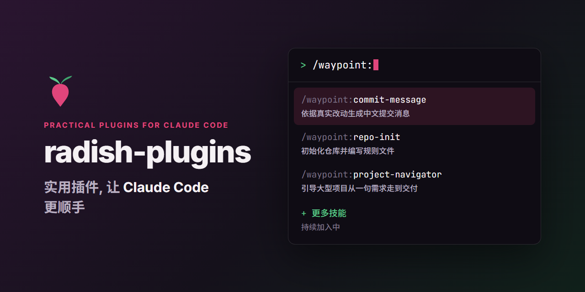

English | [简体中文](README.md)

[](https://github.com/auYeCoding/radish-plugins/actions/workflows/validate.yml)
[](plugins/waypoint/CHANGELOG.md)
[](LICENSE)

**radish-plugins** is a marketplace of practical [Claude Code](https://code.claude.com) plugins that take care of everyday development chores. It is maintained by auYeCoding, and new plugins and skills are added over time.

## Plugins

| Plugin                                    | Skills                                                                                                                                                                                                                                                                                                                                                                                                                                                                                                                                                                                                                          | Docs                                          |
| ----------------------------------------- | ------------------------------------------------------------------------------------------------------------------------------------------------------------------------------------------------------------------------------------------------------------------------------------------------------------------------------------------------------------------------------------------------------------------------------------------------------------------------------------------------------------------------------------------------------------------------------------------------------------------------------- | --------------------------------------------- |
| [WayPoint](plugins/waypoint) (`waypoint`) | [`commit-message`](plugins/waypoint/docs/commit-message.en.md): drafts a Simplified Chinese Conventional Commits message from the actual Git changes, then commits or pushes on request.<br>[`repo-init`](plugins/waypoint/docs/repo-init.en.md): initializes a Git repository with fully commented `.gitignore`, `.editorconfig`, and `.gitattributes` files.<br>[`project-navigator`](plugins/waypoint/docs/project-navigator.en.md): guides a large project from a single idea through framing, technology selection, a skeleton, and slice-by-slice delivery; it only plans and reviews, while separate sessions implement. | [Plugin guide](plugins/waypoint/README.en.md) |

Select a skill name for its detailed guide. WayPoint writes commit messages, rule-file comments, and project records in Simplified Chinese.

## Requirements

- [Claude Code](https://code.claude.com)
- [Git](https://git-scm.com)
- `project-navigator` needs [Node.js](https://nodejs.org) 22 or later.
- Optional: [GitHub CLI](https://cli.github.com) (`gh`). `repo-init` uses it to fetch `.gitignore` templates and downloads them directly when it is not installed.

## Installation

Inside Claude Code:

```text
/plugin marketplace add auYeCoding/radish-plugins
/plugin install waypoint@radish-plugins
```

Or from a terminal:

```bash
claude plugin marketplace add auYeCoding/radish-plugins
claude plugin install waypoint@radish-plugins
```

## Updating

Each plugin pins its version, so updates arrive only when a new version is released. From a terminal:

```bash
claude plugin marketplace update radish-plugins
claude plugin update waypoint@radish-plugins
```

Restart Claude Code to apply the update. See each plugin's `CHANGELOG.md` for what changed.

## Uninstalling

```bash
claude plugin uninstall waypoint@radish-plugins
claude plugin marketplace remove radish-plugins
```

## Getting help

- **Questions and ideas:** [GitHub Discussions](https://github.com/auYeCoding/radish-plugins/discussions)
- **Bugs and feature requests:** [issues](https://github.com/auYeCoding/radish-plugins/issues/new/choose)
- **Security vulnerabilities:** report them privately as described in [SECURITY.md](SECURITY.md), never in public issues.

## Contributing

Issues and pull requests are welcome. Please read the [contributing guide](CONTRIBUTING.md) and the [Code of Conduct](CODE_OF_CONDUCT.md) first.

## License

[MIT](LICENSE)

## Disclaimer

This is an independent community project. It is not affiliated with, endorsed by, or sponsored by Anthropic. "Claude" and "Claude Code" are trademarks of Anthropic, PBC.
